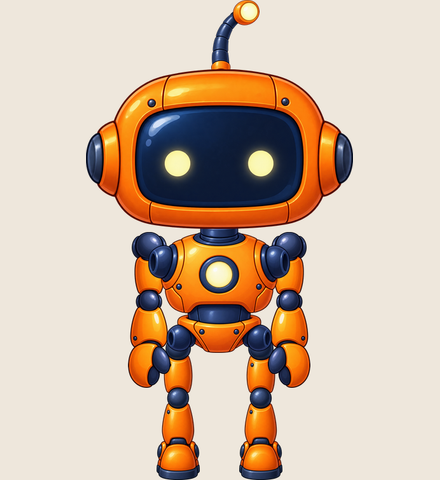
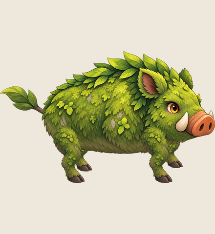
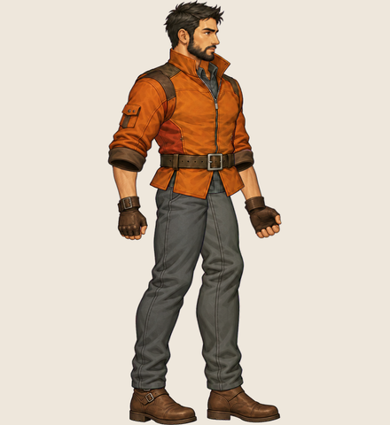
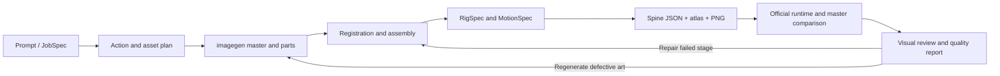
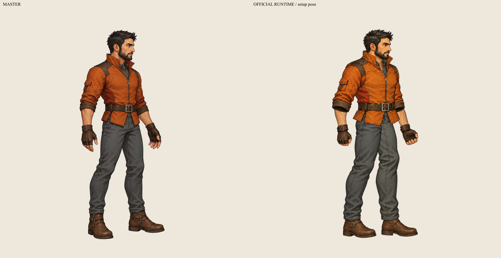

# img2spine

**从 imagegen 插画到可播放的 Spine 动画 / From imagegen artwork to playable Spine animation**

[中文](#中文) · [English](#english) · [MIT](LICENSE) · [第三方许可 / Third-party notices](THIRD_PARTY_NOTICES.md)

|         机器人 / Robot          |          苔藓野猪 / Moss boar           |            山地侦察员 / Mountain scout            |
| :-----------------------------: | :-------------------------------------: | :-----------------------------------------------: |
|  |  |  |

<a id="中文"></a>

## 中文

img2spine 是一个 **Codex 技能＋独立 TypeScript 制作工具**：Codex 分析角色和动作，调用内置 imagegen 生成母图及部件，本地程序完成配准、骨架、蒙皮、时间轴和 atlas，再用固定版本的官方 Spine runtime 验证、播放。

交付 `.json + .atlas + .png`、制作规格、母图对比和质量报告。项目不控制 Spine 编辑器，不依赖第三方 Spine MCP，也不交付 `.spine` 工程。

### 能力与工作方式

- 依据实际结构组织人形、四足、多足、蛇形、有翼等角色；横版游戏默认朝右半侧身，从正侧面向镜头转约 15–30°，保留用户明确指定的视角。
- 支持 region、透明轮廓网格、骨链权重、FK/IK、关键帧曲线、接触轨迹、离线次级运动、附件切换、deform 和绘制顺序。
- 先确定动作、材质、接缝覆盖方与近远层级，再生图和配准。肘膝、头颈等连接需要结合实际素材检查，不能套用固定部件坐标。
- 打包不旋转 atlas，保留透明裁剪偏移、边缘扩展与 straight alpha；预览读取最终导出的同一份资源。
- 拼装后与原始母图做整体配准、并排和叠加对比，再比较官方 runtime 实际 setup 帧；缺失或过期证据不能通过视觉验收。



### 快速开始

需要 Git、Node.js **22.18+**（建议 Node.js 24 LTS）和 npm。已在 Windows 11 验证；自动浏览器检查使用 Microsoft Edge。新生图另外需要支持内置 imagegen 的 Codex 环境；运行保存的样例不需要生图服务。

```sh
git clone --recurse-submodules git@github.com:swqsldz/img2spine.git
cd img2spine
npm ci --cache .cache/npm
npm run build
npm run demo:scout
npm run spine -- preview output/mountain-scout/export --port 4173
```

没有 GitHub SSH 密钥时，克隆地址可换为 `https://github.com/swqsldz/img2spine.git`。已有克隆但缺少 runtime 时运行：

```sh
git submodule update --init --recursive
```

访问 `http://127.0.0.1:4173`，可选择动作、暂停、拖动时间、调速、查看骨骼网格及下载资源。Spine runtime **只以 submodule 引用**；主仓库不提交官方源码、美术或编译后的 runtime，构建在本地完成。

### 三个可复现样例

| 样例       | 重建命令                | 输出                           | 演示内容与限制                                                                                     |
| ---------- | ----------------------- | ------------------------------ | -------------------------------------------------------------------------------------------------- |
| 山地侦察员 | `npm run demo:scout`    | `output/mountain-scout/export` | 半侧身待机、走、跑、出拳；连续腿网格、独立前领及母图对比。大幅转臂仍有分件袖口观感。               |
| 苔藓野猪   | `npm run demo:creature` | `output/moss-boar/export`      | 四足待机、走、跑、跳、冲撞；复用腿部插画，母图与部件轮廓仍有差异。                                 |
| 机器人     | `npm run demo`          | `output/robot/export`          | 待机眨眼、挥手、走跑、跳、攻击、转身；正面原型与对称肢体，转身是离散插画切换，部分切片边缘有残留。 |

所有命令使用仓库中保存的素材，不重新生图、不写回示例输入，也不复制旧视觉批准。侦察员输入保留最终归一后的拆件与配准；其他样例保留所需源图片和制作规格。详见 [样例说明](examples/README.md)。



左侧为整体对齐的母图，右侧为官方 runtime 渲染。对比用于发现头身比例、连接和遮挡问题，不以独立拉伸部件掩盖差异；握拳、落脚姿势等改动需要写入复核结论。

### 在 Codex 中制作新角色

```sh
npm run install-skill
```

安装位置为 `$CODEX_HOME/skills/img2spine`，默认使用用户目录下 `.codex/skills/img2spine`。安装器记录当前工作区位置；项目移动后需更新技能定位。已安装且属于本工作区时，使用 `npm run install-skill -- --update`，更新前自动备份。

在可使用该技能的 Codex 会话中输入：

> $img2spine 生成一只用于 2D 横版游戏的四足机械狐狸，朝右半侧身，保持四足动物结构。制作待机、原地走跑、起跳落地与冲撞。先规划接缝和遮挡，保留母图，拼装后对比原图并复核所有动作。

imagegen 由 Codex 技能调用；本地 CLI 不直接调用 Codex 内置工具。部件可以逐个生成或使用检查过的拆件图。需要真实透明 alpha；若采用纯色背景去色，必须检查轮廓、溢色与关节重叠。参考 PNG 不是原生分层文件。

### CLI 与制作数据

所有命令使用 `npm run spine -- <命令>`。

| 命令                                          | 用途                                           |
| --------------------------------------------- | ---------------------------------------------- |
| `prepare <source>`                            | 检查任务与素材计划，输出母图、拆件提示和缺失项 |
| `register <source>` / `rig <source>`          | 对应点配准；从画布关节生成局部骨骼             |
| `ingest <source> --out <work>`                | 校验透明度、裁切及归一化，保留偏移             |
| `assemble <work> --out <assembly>`            | 拼装、亮暗背景关节细节与母图对比               |
| `motion <source> --presets <JSON>`            | 将动作模板展开为可编辑时间轴                   |
| `compile <work> --out <candidate>`            | 编译 Spine JSON、atlas、纹理及比较证据         |
| `validate <candidate>` / `repair <candidate>` | 验证当前资源；生成按阶段修复任务               |
| `preview <candidate> --port 4173`             | 启动本机 WebGL 预览                            |

`JobSpec`、`AssetManifest`、`RigSpec`、`MotionSpec` 是项目自有中间格式。新任务另用 `asset-plan.json` 声明部件、连接、材质和绘制顺序。字段见 [数据约定](skills/img2spine/references/contracts.md)、[JSON Schema](schemas/) 和 [首轮制作流程](skills/img2spine/references/first-pass.md)。

### 验证与交付

```sh
npm run typecheck
npm test
npm run qa -- output/mountain-scout/export
npm run spine -- validate output/mountain-scout/export
npm run package -- output/mountain-scout/export
```

- 数据验证检查引用、有限数值、网格、权重、atlas 和版本；循环动作至少求值三次，并检查接触偏移、翻折与循环衔接。
- `qa` 使用真实 WebGL 为每个动作采样 12 帧，保存连续采样图与母图对比。需要本机 Edge；缺少浏览器时报告失败，不伪造渲染证据。
- `technicalPassed` 与 `visualPassed` 分开。数值通过后通常仍为 `needs-visual-review`；Codex 检查当前图片后才能记录带哈希的 `visual-review.json`。具体要求见 [母图比较与证据](skills/img2spine/references/master-comparison.md)。
- `repair` 给出任务，Codex 执行修复；同一失败项默认最多三轮。它不会偷偷降低动作要求或自行调用生图 API。
- `package` 在输出目录生成独立 `preview/index.html`。用静态 HTTP 服务提供整个输出目录即可播放；打包资源和 runtime 仍只存在本地输出，不提交至主仓库。

不保证首次生图即可用，也不宣称所有物种、动作或透视变化都达到成品质量。单张正面图不能可靠提供背面；多视角需要额外美术。尚未验收 Spine 编辑器导入、Unity 或移动设备。旧实验记录见 [历史研究说明](docs/HISTORICAL-RESEARCH.md)；其中未发布的本地路径和旧命令不是当前快速开始入口。

本次干净检出的验证记录见 [发布验证](docs/release-validation.json)：33 项测试、16 个动作、192 帧浏览器采样。该记录不自动授予重新构建后的视觉批准。

### Runtime 与许可

| 项目      | 固定值                                     |
| --------- | ------------------------------------------ |
| submodule | `reference/spine-runtimes`                 |
| 参考分支  | `4.3`                                      |
| 源码提交  | `4309c05c287d3f15da778e68f5d2a483fe10a6a3` |
| 包版本    | `4.3.13`                                   |
| 数据格式  | `4.3.75-beta`                              |

构建检查提交和相关 runtime 源码状态。升级需重新验证，不能仅修改版本号绕过检查。

自有代码与文档采用 [MIT](LICENSE)。官方 runtime 适用 [Spine Runtimes License Agreement](https://en.esotericsoftware.com/spine-runtimes-license)，不受本项目 MIT 重新授权。不调用 Spine 编辑器不代表免除 runtime 的许可条件。生成样例的来源与授权边界见 [第三方声明](THIRD_PARTY_NOTICES.md)。

---

<a id="english"></a>

## English

img2spine combines a **Codex skill with independent TypeScript production tools**. Codex interprets the character and motion brief and generates master artwork and parts through built-in imagegen. Local tools handle registration, rigs, skinning, timelines and atlas packing, then validate and preview the result with a pinned official Spine runtime.

Outputs include `.json + .atlas + .png`, production specifications, master comparisons and quality reports. The project does not control the Spine Editor, depend on third-party Spine MCP servers, or produce `.spine` projects.

### Capabilities and workflow

- Describe the actual anatomy of humanoids, quadrupeds, multi-legged, serpentine and winged characters. Side-scrollers default to a right-facing, mostly side-on view, about 15–30 degrees toward the viewer; explicit user views take precedence.
- Region attachments, alpha-contour grids, bone-chain weights, FK/IK, keyframe curves, contact trajectories, baked secondary motion, attachment swaps, deform and draw-order timelines.
- Plan actions, materials, seam ownership and near/far order before generation. Register actual landmarks and inspect elbows, knees and necks instead of reusing universal coordinates.
- Non-rotating atlases preserve trim offsets, edge extrusion and straight alpha. Preview and export use the same resources.
- Compare the assembled character with the original using one global transform, side-by-side views and overlays, then compare the official runtime setup frame. Missing or stale evidence cannot satisfy visual approval.

The workflow is **brief → action/asset plan → imagegen → registration/assembly → rig/motion → Spine export → runtime and master comparison → visual review**, with repairs returning to the failed stage.

### Quick start

Requires Git, **Node.js 22.18+** (Node.js 24 LTS recommended) and npm. Verified on Windows 11; automated browser checks use Microsoft Edge. New artwork requires a Codex environment with built-in imagegen. Rebuilding saved examples does not require image generation access.

```sh
git clone --recurse-submodules git@github.com:swqsldz/img2spine.git
cd img2spine
npm ci --cache .cache/npm
npm run build
npm run demo:scout
npm run spine -- preview output/mountain-scout/export --port 4173
```

Without GitHub SSH keys, use `https://github.com/swqsldz/img2spine.git` as the clone URL. For an existing clone missing the runtime:

```sh
git submodule update --init --recursive
```

Open `http://127.0.0.1:4173` to select animations, pause, scrub, change speed, inspect bones/meshes and download resources. The official runtime is **only a Git submodule**: its source, artwork and compiled bundles are not committed to this parent repository. Builds happen locally.

### Reproducible examples

| Example        | Command                 | Output                         | Demonstration and limitations                                                                                                                                                |
| -------------- | ----------------------- | ------------------------------ | ---------------------------------------------------------------------------------------------------------------------------------------------------------------------------- |
| Mountain scout | `npm run demo:scout`    | `output/mountain-scout/export` | Half-side idle, walk, run and punch; continuous trouser meshes, separate front collar and master comparison. Large arm rotations retain a cutout sleeve appearance.          |
| Moss boar      | `npm run demo:creature` | `output/moss-boar/export`      | Quadruped idle, walk, run, hop and lunge. Reuses a leg illustration; master and assembled silhouettes differ.                                                                |
| Robot          | `npm run demo`          | `output/robot/export`          | Idle/blink, wave, walk/run, jump, attack and turn. Frontal prototype with symmetric limbs; turning uses discrete alternate illustrations; some sliced edge fragments remain. |

Commands reuse saved artwork, do not write back to example inputs, and do not copy previous visual approvals. The scout preserves final normalized cutouts and registration; other examples retain required source artwork and specifications. See [example notes](examples/README.md).

The master/runtime comparison shown above exposes proportion, connection and occlusion differences. It does not independently stretch reference parts to hide errors. Intentional changes such as fists or gameplay foot placement must be recorded in the review.

### Create a character in Codex

```sh
npm run install-skill
```

The installer uses `$CODEX_HOME/skills/img2spine`, defaulting to `.codex/skills/img2spine` in your home directory, and records the workspace location. Update this location if the project moves. To update an existing installation owned by this workspace, run `npm run install-skill -- --update`; the installer backs it up first.

In a Codex session where the skill is available:

> $img2spine Create a quadruped mechanical fox for a 2D side-scroller, facing right in a half-side view. Keep its animal anatomy. Include idle, in-place walk/run, takeoff and landing, and a charge. Plan seams and occlusion first, retain the master, compare the assembly against it, and inspect every animation.

The skill calls built-in imagegen; the local CLI cannot directly call Codex tools. Generate individual parts or inspect a whole parts sheet. Require real alpha; a solid-color keying route needs silhouette, spill and overlap checks. A reference PNG is not a native layered file.

### CLI and production data

Use `npm run spine -- <command>`.

| Command                                       | Purpose                                                                |
| --------------------------------------------- | ---------------------------------------------------------------------- |
| `prepare <source>`                            | Check the job/asset plan; emit master/parts prompts and missing inputs |
| `register <source>` / `rig <source>`          | Fit landmarks; derive local bones from canvas joints                   |
| `ingest <source> --out <work>`                | Validate alpha, crop and normalize while preserving offsets            |
| `assemble <work> --out <assembly>`            | Reconstruct, inspect light/dark joints and compare the master          |
| `motion <source> --presets <JSON>`            | Expand motion presets into editable timelines                          |
| `compile <work> --out <candidate>`            | Export Spine JSON, atlas, textures and comparison evidence             |
| `validate <candidate>` / `repair <candidate>` | Validate current artifacts; produce stage-specific repair tasks        |
| `preview <candidate> --port 4173`             | Start a local WebGL preview                                            |

`JobSpec`, `AssetManifest`, `RigSpec` and `MotionSpec` are project-owned intermediate formats. New jobs also use `asset-plan.json` for parts, joints, materials and draw order. See [contracts](skills/img2spine/references/contracts.md), [JSON Schemas](schemas/) and the [first-pass workflow](skills/img2spine/references/first-pass.md).

### Validation and delivery

```sh
npm run typecheck
npm test
npm run qa -- output/mountain-scout/export
npm run spine -- validate output/mountain-scout/export
npm run package -- output/mountain-scout/export
```

- Data checks cover references, finite values, meshes, weights, atlas and runtime versions. Looping actions are evaluated for at least three cycles, including contact drift, triangle folds and loop seams.
- `qa` captures 12 official WebGL frames per animation, contact sheets and master comparisons. It requires Edge and reports browser failures rather than fabricating evidence.
- `technicalPassed` and `visualPassed` are separate. Numerically correct output usually remains `needs-visual-review` until Codex inspects current images and records a hash-bound `visual-review.json`. See [master comparison and evidence](skills/img2spine/references/master-comparison.md).
- `repair` produces tasks for Codex to execute, with three repair rounds per issue by default. It does not silently reduce requested motion or call an image API.
- `package` creates a standalone `preview/index.html` inside the output directory. Serve the entire directory over static HTTP; packaged resources and runtime stay in local output and are not committed to the parent repository.

First-generation usability is not guaranteed. Not every morphology, action or perspective is production-ready. A frontal illustration cannot reliably supply a back view; extra perspectives require artwork. Spine Editor import, Unity and mobile-device integration have not been accepted. [Historical research notes](docs/HISTORICAL-RESEARCH.md) reference local experiments whose excluded artifacts and old commands are not current quick-start instructions.

See the [release validation record](docs/release-validation.json): 33 tests, 16 animations and 192 browser frames from a clean checkout. This record does not automatically approve future rebuilds.

### Runtime and licensing

| Item             | Pinned value                               |
| ---------------- | ------------------------------------------ |
| Submodule        | `reference/spine-runtimes`                 |
| Reference branch | `4.3`                                      |
| Source commit    | `4309c05c287d3f15da778e68f5d2a483fe10a6a3` |
| Package version  | `4.3.13`                                   |
| Data format      | `4.3.75-beta`                              |

Builds verify the commit and relevant runtime source state. Upgrades require revalidation; changing version labels is not a compatibility fix.

Original project code and documentation use [MIT](LICENSE). The official runtime follows the [Spine Runtimes License Agreement](https://en.esotericsoftware.com/spine-runtimes-license), not this project's MIT license. Avoiding the Spine Editor during generation does not waive runtime licensing conditions. See [third-party notices](THIRD_PARTY_NOTICES.md) for generated example provenance and licensing boundaries.
